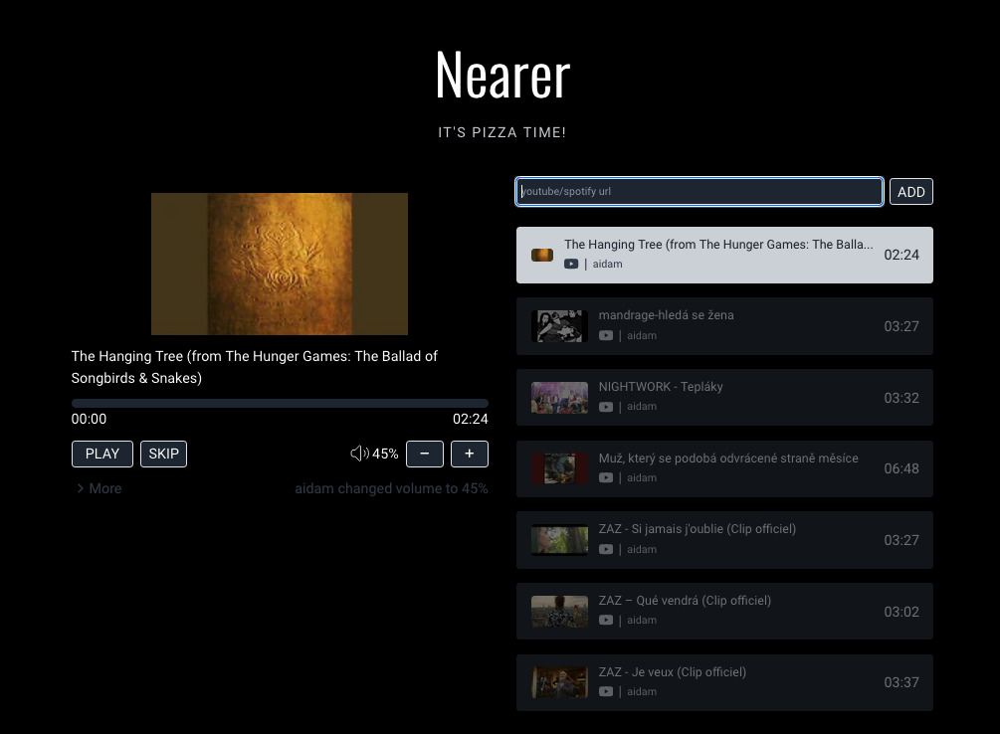

# Nearer

A collaborative music server.

**Features:**

- Queuing songs from YouTube and Spotify
- Controlling value, play/pause, and skip

## Development

To develop Nearer you only need  and . Clone this repo and run `pnpm install` in both `nearer-server` and `nearer-website`.